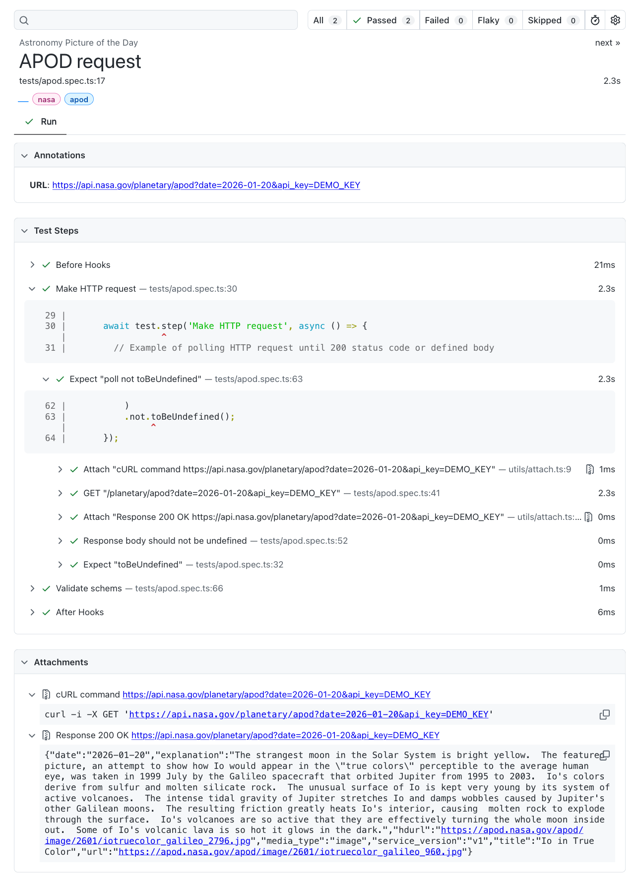

# Technical Requirements for a Test Automation Framework for End-to-End API Testing

[](https://github.com/adequatica/api-testing-playwright/actions/workflows/run-playwright-api-tests.yaml)

And how Playwright satisfies these requirements:

1. Use only standard components (yes, [Playwright](https://playwright.dev/)):
   - Easy to install dependencies (a single [NPM package](https://www.npmjs.com/package/playwright) for the whole framework)
   - Easy to configure ([config file](https://playwright.dev/docs/test-configuration))
   - Easy to use HTTP library ([suitable for API testing](https://playwright.dev/docs/api-testing). API testing with Playwright does not require browsers installation. However, browser will be needed if you decide to run the tests in [UI Mode](https://playwright.dev/docs/test-ui-mode) for debugging)
2. Well tests organization:
   - Logical division of tests into suites, steps, and nested steps ([test function](https://playwright.dev/docs/api/class-test))
   - Global preconditions and postconditions ([global setup and teardown](https://playwright.dev/docs/test-global-setup-teardown))
   - Preconditions and postconditions for a single test (by [beforeAll](https://playwright.dev/docs/api/class-test#test-before-all) and [afterAll](https://playwright.dev/docs/api/class-test#test-after-all) hooks)
   - Easy to use assertions (only Playwright’s [non-retrying assertions](https://playwright.dev/docs/test-assertions#non-retrying-assertions) are valuable for API testing)
   - Custom error messages ([custom expect message](https://playwright.dev/docs/test-assertions#custom-expect-message)) and custom assertions (this can be implemented through [fixtures](https://playwright.dev/docs/test-fixtures))
   - Table-driven tests ([parameterize tests](https://playwright.dev/docs/test-parameterize))
   - Contract testing (supported by third-party libraries like [Ajv](https://ajv.js.org/) or [Zod](https://zod.dev/))
3. Various ways to bypass the instability of the fragile tested infrastructure (unexpected errors, timeouts) which leads to false-positive fails:
   - Retry HTTP request based on conditions (Playwright does not support this feature, but it can be implemented through [expect.poll](https://playwright.dev/docs/test-assertions#expectpoll) or [expect.toPass](https://playwright.dev/docs/test-assertions#expecttopass) methods)
   - Retry tests during the test run ([retries feature](https://playwright.dev/docs/test-retries))
   - Re-run only failed tests after a test run (`--last-failed` [CLI option](https://playwright.dev/docs/test-cli#all-options))
   - Individual timeouts for different test cases ([multiple configurable timeouts](https://playwright.dev/docs/test-timeouts) and [test.slow](https://playwright.dev/docs/api/class-test#test-slow) method)
   - Do not terminate test execution in case of a failed assertion ([soft assertions](https://playwright.dev/docs/test-assertions#soft-assertions))
4. Scaling:
   - Parallel execution ([parallelism](https://playwright.dev/docs/test-parallel)) and sequential launch if needed (this is configurable at the [test](https://playwright.dev/docs/api/class-test#test-describe-configure) and [workes](https://playwright.dev/docs/test-parallel#disable-parallelism) level)
   - Filtering tests: «running by [tag](https://playwright.dev/docs/test-annotations#tag-tests)», exclude tests from a run, run only a single test (by `--grep` and `--grep-invert` [CLI options](https://playwright.dev/docs/test-projects#test-filtering) or by the [test.only](https://playwright.dev/docs/api/class-test#test-only) method, as well as on the the describe level)
   - Skipping tests (by [test.skip](https://playwright.dev/docs/api/class-test#test-skip) and [test.fixme](https://playwright.dev/docs/api/class-test#test-fixme) methods, as well as on the describe level)
5. Good test reports:
   - Good [build-in reporters](https://playwright.dev/docs/test-reporters#built-in-reporters) (especially [HTML one](https://playwright.dev/docs/running-tests#test-reports))
   - Adding your own debug information to the report ([test.info](https://playwright.dev/docs/api/class-test#test-info) method, even with [attachments](https://playwright.dev/docs/api/class-testinfo#test-info-attach)) — for API tests you definitely need [cURL](https://curl.se/docs/manpage.html) command for manual HTTP debugging
   - Easy to add [Allure report](https://allurereport.org/docs/playwright/) (optional)

## Stack

A basic set of packages for API testing with Playwright:

- [Playwright](https://playwright.dev/) — testing framework
- [Zod](https://zod.dev/) — JSON schema validator
- [Daj.js](https://day.js.org/) — minimalist date utility library
- [Prettier](https://prettier.io) — code formatter
- [ESLint](https://eslint.org/) — code linter
- [Vitest](https://vitest.dev/) — unit testing framework (optional)

Example API for testing: [NASA API](https://api.nasa.gov/)

## How to Use

You have to have [Node.js](https://nodejs.org/) >= 24 (LTS):

1. Clone repository
2. Install dependencies: `npm install`
3. Run tests: `npm run test`

### CLI Options

- A different tested host can be passed to the tests through an environment variable (it can be useful for testing different environments):

```shell
BASE_URL=https://api.nasa.gov npm run test
```

- An individual API key can be passed to the tests through an environment variable; otherwise, the DEMO_KEY value will be used.

```shell
API_KEY={api_key} npm run test
```

- Run a single test or tests that match a [specific criteria](https://playwright.dev/docs/test-annotations#tag-tests):

```shell
npm run test -- --grep @nasa
```

- Run tests in [UI Mode](https://playwright.dev/docs/test-ui-mode):

```shell
npm run test -- --ui
```

- Run unit tests for utils functions

```shell
npm run test:unit
```

## Concepts

- All interactions with environment variables are carried out in `/utils/env.ts` file
- All constants (endpoints, timeouts, etc.) are contained in their respective directories
- Each request and response is logged in the report ([read more about it](https://adequatica.github.io/2025/10/29/make-enriched-e2e-api-tests-reports.html))
- Expect messages should be written in BDD (Behavior-Driven Development) style, such as «_something should have something_»
- Most utils/helpers functions should have unit tests (optional)

Sample test report:


